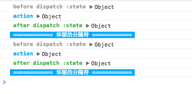

#撸一个面向对象风格的redux
###redux使用感受
各种优点就不说了，有一点觉得很不爽的地方：

1. 示例工程，文件夹太散。具体而言`action`,`reduce`,`store`,三者的对应关系很固定，分在三个文件夹下，实在太散。

2. `redux`的源码使用了大量的`函数式`的pattern。以我的经验，很多工程师对函数式风格不熟悉，更熟悉面向对象的风格。

所以,我就撸了一个面向对象风格的简易版，代码数少到不行，[代码在github上](https://github.com/jzlxiaohei/zlux)，（还附带了`react-redux`的`connect`的简易版，不过方面的代码注释掉了，因为这是为了配合react的功能，而redux的设计有独立于react的初衷。

在本人的一个demo项目中，使用下来，感觉还行。[demo地址](http://dapigu.wallstcn.com/react-test.html) 样式上主要适配手机，pc上也能看，另外控制台有列表页加载数据的log，如下图。demo的代码暂时不对外，需要整理。

##store的简单实现（无中间件功能）
1.`action`，`reduce`必须要使用者提供.同redux一样，要求每次`reduce`返回全新的`state`对象

`dispatch`的功能相对固定，另外提供一个`subscribe`方法，用来注册监听器，`dispatch`时，通知所有监听者。

根据这些要求，写一个BaseStore。用户需要继承BaseStore，提供`reduce`函数

	export default class BaseStore{
    
        listeners=[]
    
        dispatch(action){
            this.state = this.reduce(action);
            this.listeners.forEach(listen=>{
                listen(action,this.getState())
            })
        }
    
        subscribe(listener){
            var index = this.listeners.length
            this.listeners.push(listener);
    
            return (index)=>{
                return ()=>{
                    this.listeners.splice(index);
                }
            }(index)
        }
    
    
        reduce(action){
            throw new Error('subClass fo BaseStore should implement reducer function')
        }
    
        getState(){
            return this.state;
        }
    
    }
    
    
使用的时候，只需继承`BaseStore`,提供`reduce`函数就行

	import Immutable from 'immutable';
    import {BaseStore} from 'zlux'
    
    const ActionTypes={
        ADD:'ADD',
        DELETE_BY_ID:'DELETE_BY_ID',
        UPDATE:'UPDATE'
    }
    
    export default class SimpleStore extends BaseStore{
        __className ='PostListStore'
    
        state = new Immutable.List()
    
        reduce(action){
            if(action.type === ActionTypes.ADD){
                return state.push(action.payLoad)
            }
            if(action.type === ActionTypes.DELETE_BY_ID){
                let id = action.payLoad.id;
                return state.filter(item=>{return item.id !==id})
            }
            if(action.type == ActionTypes.UPDATE){
                var id = action.payLoad.id;
                var index = state.findIndex(item=>{return item.id == id});
                //if index == -1, 这里不考虑update时，没有相应item的情况
                return state.set(index,action.payLoad)
            }
    
            return state; //注意：默认返回原state
        }
        
        //提供方便外接调用的方法
        add(payLoad){
            this.dispatch({
                type:ActionTypes.ADD,
                payLoad
            })
        }
        
        deleteById(payLoad){
            this.dispatch({
                type:ActionTypes.DELETE_BY_ID,
                payLoad
            })
        }
        
        update(payLoad){
            this.dispatch({
                type:ActionTypes.UPDATE,
                payLoad
            })
        }
    }

然后像这样使用：
	
   	var ss = new SimpleStore()
   	ss.add({id:1,content:'hello'})
   	ss.update({id:1,content:'world'})
   	ss.deleteById({id:1})

每次调用dispatch，`ss.getState()`都会返回最新的state。因为使用了`immutable`的list，确保每次的`state`都是全新的。

##中间件
关于redux的中间件的来龙去脉，官方文档已经说得不能在详细，[文档地址](http://rackt.github.io/redux/docs/advanced/Middleware.html)

这里实现中间件，故意做的和`express`中的用法很像。如下：

	simpleStore.use(
    	function(next,action,store){
      		console.log('before')
      		next()
      		console.log('after')
        }，
        function(next){
        	if(isLogin){
        		next()
        	}
        	else{
        		goToLogin();
        	}
        }
	)

稍微有些区别，

1. 需要用中间件，要一次性的传个`use`函数，多次使用`use`，后面的会覆盖前面的。

2. 中间件函数中，参数只有next是必须的。`action`和`store` 都是自动注入的。需要用就写上，不需要用，就不用管。
3. 暂时没使用error first的模式。个人认为`state`中完全可以体现错误信息。
	
中间实现的核心代码如下：

	use(...fns){
        this.middlewareFns = fns;
        var _this =this;
        this.wrappedDispatch= this.middlewareFns.reduceRight((a,b)=>{
            return ()=>{
                b(a,_this.__curAction,_this)
            }
        },this.__dispatch)//__dispatch是原始的dispatch实现。
    }
    
    //..改写上面的dispatch实现。
    dispatch(action){
        this.__curAction = action
        this.wrappedDispatch();
    }

